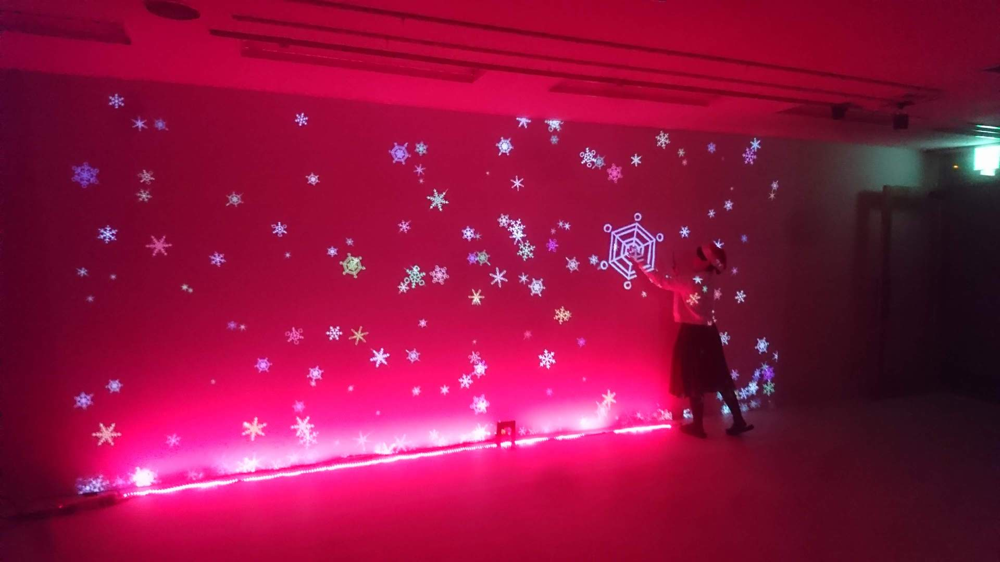
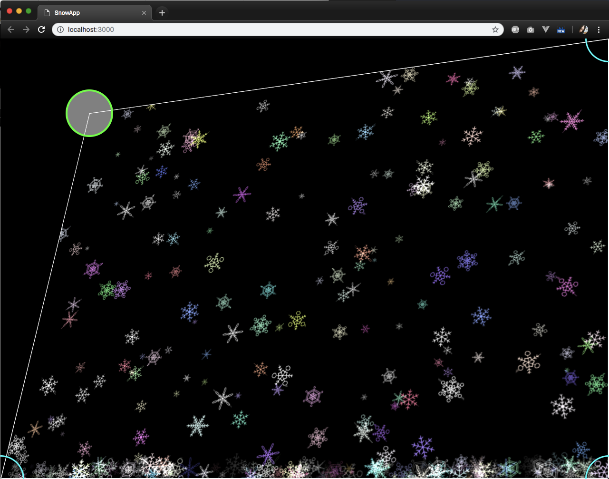

# Xmas2018_SnowApp
クリスマス会用の賑やかし。  
なるべくoFとOSCを使わずに作ってみるチャレンジ。  



## SnowApp
壁面投影側。  
JS + CSSでQuadWarp  
three.jsで雪のパーティクル  


```
$ cd /path-to-project-dir/SnowApp
$ npm install
$ npm start
```


## SnowApp_oF

測域センサー(UST-10LX)でタッチ判定  
  
雪に触れたら、  
`Arduino`で`NeoPixel`を雪と同じ色で光らせる。  
ランダムで音を鳴らす（jsだとマルチプレイが面倒そうだったのでoFで実装）  


### dependences
ofxGui  
[ofxLibwebsockets](https://github.com/robotconscience/ofxLibwebsockets)  
[ofxUST](https://github.com/watab0shi/ofxUST)

## NeoPixel
`Arduino`で、`oF`から`Serial`でHexColorを受信してその色でNeoPixelを光らせる。  
  